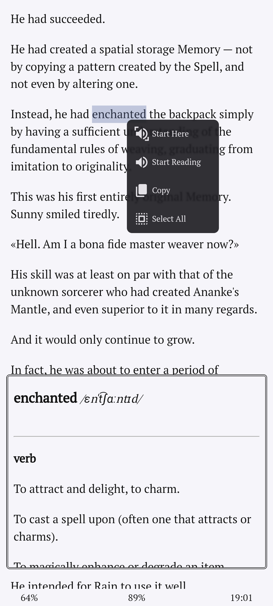

# LNReader Dictionary
Custom JS Script for Kindle like dictionary for [LNReader](https://github.com/LNReader/lnreader).

    
    
    

Select a word and get its meaning right in the book. This script uses free dictionary API by [https://dictionaryapi.dev](https://dictionaryapi.dev/)

To use this script simply everything from `main.js` and paste it at the end of your custom JS. Custom themes might not work in older versions of app.